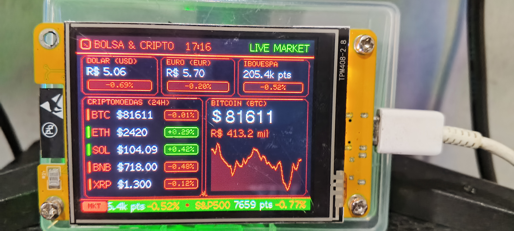
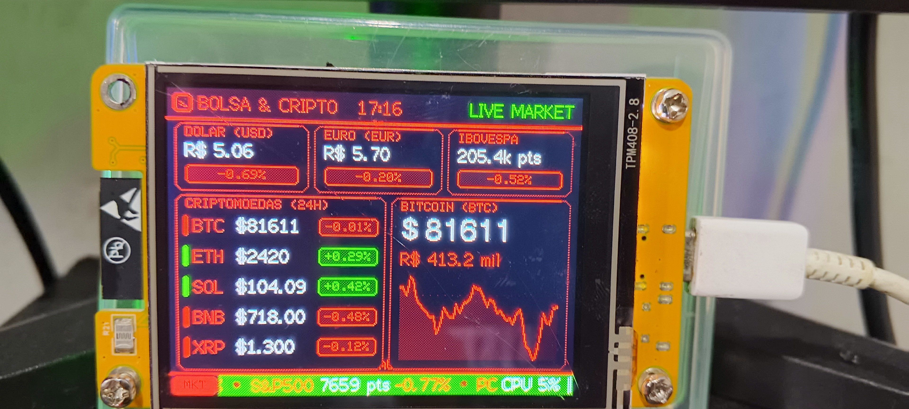
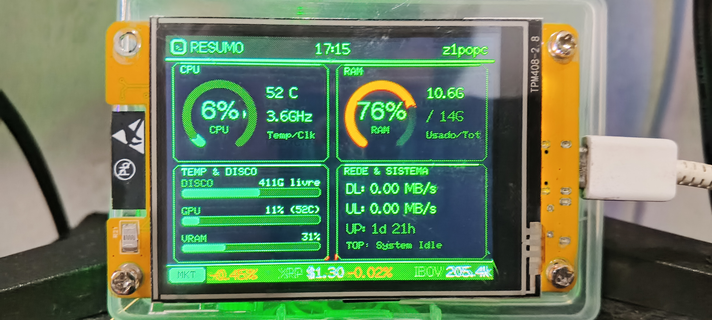
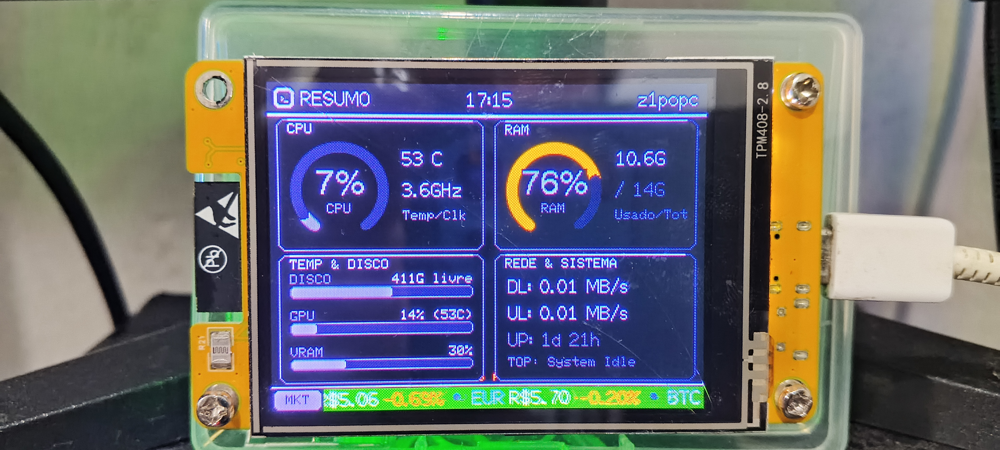
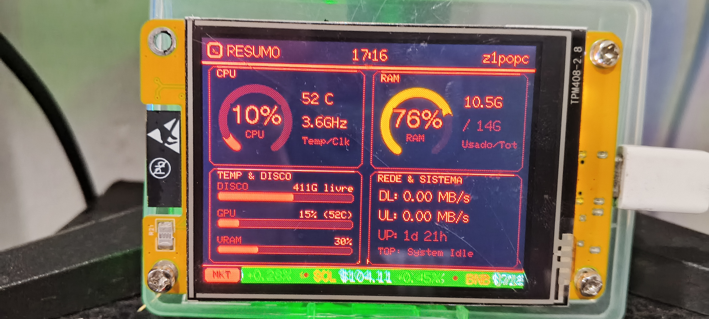
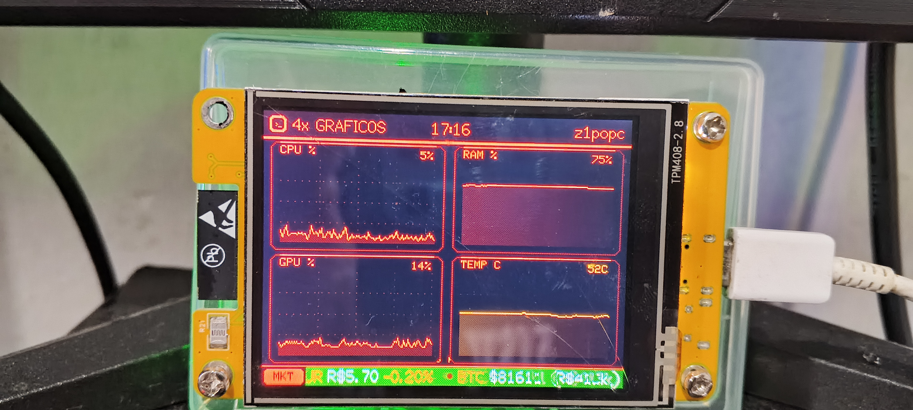

# ⚡ CYD Hardware & Financial Market Monitor (v4.0)


-blue?style=for-the-badge&logo=espressif)

-FF5500?style=for-the-badge)


Um **monitor de hardware, terminal de mercado financeiro e hub de produtividade multimídia em tempo real** de código aberto para a placa **ESP32-2432S028R (*Cheap Yellow Display* / CYD 2.8" 320×240)**, controlado **100% pelo PC via USB Serial** através de uma interface desktop moderna em abas construída em **Flet (Flutter para Python)** e controle remoto pelo smartphone via **Wi-Fi local (PWA)**.

---

## 📸 Galeria do Projeto (v4.0 em Funcionamento Real)

### 💻 1. Painel de Controle Desktop v4.0 — Navegação em 6 Abas Organizadas

#### 📊 Aba 0: Painel Geral, Telemetria & Grade das 10 Telas
<p align="center">
  
</p>

#### 🍅🎵 Aba 1: Foco & Mídia — Pomodoro Focus Hub (Tela 8) + Player Spotify & YouTube Music (Tela 9)
<p align="center">
  
</p>

#### 💼 Aba 2: Mercado Financeiro (Tela 6) & Portfólio Pessoal de Investimentos (Tela 7)
<p align="center">
  
</p>

#### 🎨☀️ Aba 3: Estúdio de Cores RGB565, Fundo SD, Brilho PWM & Modo Sleep/Noturno
<p align="center">
  
</p>

#### 🔔 Aba 4: Sistema de Alertas Físicos Avançados (Buzzer & LED RGB)
<p align="center">
  
</p>

---

### 🖥️ Telas em Execução na Placa CYD (Hardware Real)
<p align="center">
  
  
</p>
<p align="center">
  
  
</p>
<p align="center">
  
  
</p>

---

## 🎯 Destaques e Novidades da Versão 4.0

* **🗂️ Arquitetura por Abas (Desktop & Mobile):** Fim da rolagem vertical poluída. Agora o app desktop possui um cabeçalho fixo com micro-indicadores globais e **6 abas limpas e fluidas**. O app mobile (PWA) foi expandido para **5 abas navegáveis**.
* **🍅 Módulo de Foco Pomodoro (Tela 8):** Máquina de estados completa no PC (Trabalho 25m, Pausa Curta 5m, Pausa Longa 15m), anel circular anti-flicker (`drawSmoothArc`) na CYD com interpolação de 1s, contador de ciclos diários e **bipes sonoros automáticos no Buzzer** ao concluir cada ciclo.
* **🎵 Hub Multimídia Spotify & YouTube Music (Tela 9):**
  * Integração nativa com Windows GSMTC (`winrt.windows.media.control`) identificando **Spotify** (Desktop/Store/Web) e **YouTube Music** (Chrome/Edge/Brave/Firefox/PWA/Desktop).
  * Redimensionamento inteligente da capa para **320×240 JPEG** (com remoção automática de faixas pretas em thumbnails 16:9) e transmissão em blocos Base64 para o MicroSD (`_media_cov.jpg`).
  * **Overlay Translúcido Real (*Alpha-Blending* RGB565 em Hardware):** Renderiza a capa do álbum com vidro fumê escuro mantendo a leitura nítida de Título, Artista, badge dinâmico da fonte e barra de progresso.
* **💼 Gestão de Portfólio de Investimentos (Tela 7):** Monitoramento de patrimônio pessoal em Reais (`R$`), cálculo de Lucro/Prejuízo (PnL) histórico ou diário (24h) com cor dinâmica (verde/vermelho) e ranking dos Top 3 ativos da carteira (Cripto, B3, Câmbio e EUA).
* **🔔 Sistema de Alertas Físicos Avançados:** Criação de gatilhos customizados (`CPU Temp > 85°C`, `GPU Uso > 95%`, `Bitcoin > $100k`, etc.) para disparar **bipes sonoros no Buzzer** e padrões visuais no **LED RGB traseiro** da CYD sem travar o processamento do ESP32.
* **🌙 Controle de Brilho Dinâmico & Modo Sleep:** Monitoramento de inatividade do mouse/teclado no PC para apagar a tela (`brt: 0`), Modo Noturno automático entre 22h e 06h e transição suave por PWM no Pino 21.

---

## 📍 Estágio Atual do Projeto & Roadmap

| Versão | Descrição | Status |
| :--- | :--- | :---: |
| **v1.0** | Telemetria básica de Hardware (CPU, GPU, RAM, Disco, Rede) via USB Serial | ✅ Concluído |
| **v2.0** | **Arquitetura *No-Touch***: Suporte a Wallpapers no MicroSD, Color Picker RGB565 e Brilho PWM | ✅ Concluído |
| **v3.0** | **Painel Desktop em Flet** + **Gráfico Duplo CPU vs RAM** + **Terminal Financeiro (Bolsa & Cripto)** + **Ticker Tape a ~28 FPS** | ✅ Concluído |
| **v3.1** | **Controle Remoto pelo Celular (Wi-Fi PWA com QR Code & App Flutter em `mobile/`)** + **Upload de fotos do smartphone p/ SD** | ✅ Concluído |
| **v4.0 (Atual)** | **Pomodoro (Tela 8) + Spotify & YouTube Music (Tela 9) + Portfólio Pessoal (Tela 7) + Alertas Físicos Buzzer/LED + Modo Sleep/Noturno + UI 6 Abas** | ✅ **Concluído (v4.0)** |
| **v4.1 (Próximo)** | **Notificações Inteligentes no Ticker Tape** (interceptação temporária do rodapé para avisos do OS) | 🚧 Em Andamento |

---

## 🖥️ As 10 Telas da CYD (320×240)

Todas as telas podem ser alternadas instantaneamente pelo painel Desktop, pelo aplicativo do celular (Wi-Fi) ou pelo botão físico `BOOT` traseiro:

1. **Tela 0 — `Resumo Gauges` (`SCR_RESUMO`):** Gauges circulares suaves de CPU % e RAM %, clock, temperatura, GPU, VRAM, Disco, Rede e Letreiro da Bolsa no rodapé.
2. **Tela 1 — `CPU + RAM Principal` (`SCR_CPU_RAM`):** Visual clássico *cyberpunk terminal* com barras duplas segmentadas, 2 gráficos dedicados de histórico lado a lado e Letreiro da Bolsa.
3. **Tela 2 — `Gráfico Duplo CPU vs RAM` (`SCR_CPU_RAM_DUAL`):** Osciloscópio de tela cheia sobrepondo curvas históricas de uso de CPU e RAM em tempo real.
4. **Tela 3 — `GPU Focus` (`SCR_GPU_FOCUS`):** Medidor grande de carga de GPU, temperatura, consumo em Watts (`W`), contador de FPS e barra de VRAM.
5. **Tela 4 — `4x Gráficos em Tempo Real` (`SCR_GRAPH`):** Grid 2×2 com gráficos simultâneos para `CPU %`, `RAM %`, `GPU %` e `TEMP °C`.
6. **Tela 5 — `Wallpaper HUD` (`SCR_WALLPAPER`):** Foco na imagem/arte do Cartão MicroSD com dock minimalista de hardware e Letreiro da Bolsa.
7. **Tela 6 — `Mercado Financeiro & Bolsa` (`SCR_MARKET`):** Terminal Bloomberg/B3 com Dólar, Euro, IBOVESPA, Top 5 Criptos e Gráfico Sparkline de Bitcoin 24h.
8. **💼 Tela 7 — `Portfólio de Investimentos` (`SCR_PORTFOLIO`):** Patrimônio total consolidado (`R$`), badge dinâmico de PnL (Lucro/Prejuízo) e Top 3 ativos da carteira.
9. **🍅 Tela 8 — `Pomodoro Focus Hub` (`SCR_POMODORO`):** Cronômetro circular anti-flicker (25m Trabalho / 5m Pausa / 15m Longa), contador de ciclos, mini-status da música atual e bipe no Buzzer ao finalizar.
10. **🎵 Tela 9 — `Player Spotify & YouTube Music` (`SCR_MEDIA`):** Capa do álbum em tela cheia do MicroSD com card de vidro fumê translúcido, Título, Artista, badge de fonte (`SPOTIFY` verde / `YT MUSIC` vermelho) e barra de progresso.

---

## 📱 Controle Remoto pelo Celular (Wi-Fi PWA & App Flutter Nativo)

Controle 100% da sua placa CYD à distância sem instalar nada no smartphone:

1. **Acesso Instantâneo via QR Code:**
   - Ao abrir o painel desktop, o servidor web local inicia na porta `8088` (com failover automático para portas seguintes caso ocupada).
   - Aponte a câmera do celular para o QR Code exibido na Aba **Remoto & Serial** ou no ícone do cabeçalho.
2. **5 Abas no Celular:**
   - 📺 **Telas:** Seletor em grade 2 colunas para as 10 telas (`0` a `9`).
   - 🎵 **Foco & Mídia:** Controles remotos completos do Pomodoro (`▶`, `↺`, `⏭`, seleção de fase) e do player Spotify / YouTube Music (`⏮`, `⏯`, `⏭`, reenviar capa ao SD).
   - 📊 **Métricas:** Telemetria ao vivo do PC, resumo do Portfólio Pessoal e cotações de mercado.
   - 🎨 **Cores:** Paletas de 1-toque, Color Picker RGB565 e disparador de teste do Buzzer/LED.
   - 🖼️ **SD & Energia:** Upload de fotos da câmera/galeria para o MicroSD, ajuste de brilho PWM e toggles de **Modo Sleep** e **Modo Noturno**.
3. **App Nativo Flutter:** O diretório [`mobile/`](mobile/) contém a codebase completa em Flutter pronta para compilação nativa em Android ou iOS.

---

## 📂 Estrutura do Repositório

```text
minimal-monitor/
├── firmware/                        # Firmware C++ para ESP32-2432S028R (CYD)
│   ├── minimal_monitor/
│   │   ├── minimal_monitor.ino      # Loop principal, decodificador JPEG com alpha-blending, 10 telas e parser JSON
│   │   └── ui_theme.h               # Definições das 10 telas (SCR_0..SCR_9), pinos Buzzer/LED e paletas RGB565
│   └── User_Setup.h                 # Configurações de barramento SPI e pinagem TFT_eSPI
│
├── agent/                           # Agente Desktop (PC) em Flet (Flutter) e Servidor Web Mobile
│   ├── agent.py                     # Coletor Hardware + Mercado + PomodoroEngine + MediaCollector + GUI Flet 6 Abas
│   ├── mobile_web.py                # Interface Web Mobile (PWA) de alta performance em 5 abas
│   ├── file_version_info.txt        # Metadados de versão Windows (v4.0.0.0) para o executável
│   ├── requirements.txt             # Dependências Python (Flet, WinRT, Pillow, psutil, pyserial, etc.)
│   ├── ui_config.json               # Configuração persistida de telas, cores, alertas e carteira
│   ├── CYD-Hardware-Monitor.spec    # Especificação PyInstaller para build do executável
│   └── dist/
│       └── CYD-Hardware-Monitor.exe # Executável standalone Windows pronto para uso (v4.0)
│
├── mobile/                          # Projeto Flutter nativo para Android e iOS
│   ├── README.md                    # Instruções de compilação do APK nativo
│   ├── pubspec.yaml                 # Dependências do app Flutter
│   └── lib/                         # Código Dart (telas, modelos e serviços SSE)
│
├── preview/                         # Capturas de tela reais do Painel Desktop v4.0 e da placa CYD
├── imgs/                            # Ícone oficial da aplicação (imgsCYD.ico)
├── platformio.ini                   # Manifesto de compilação PlatformIO para ESP32 (CYD)
└── README.md                        # Documentação completa do projeto
```

---

## 🚀 Como Usar e Instalar

### Opção A: Executável Pronto para Windows (Sem instalar Python)
Basta executar o binário compilado:
```powershell
.\agent\dist\CYD-Hardware-Monitor.exe
```

### Opção B: Rodando a partir do Código-Fonte Python
1. Ative o ambiente virtual e instale as dependências:
   ```powershell
   .\.venv\Scripts\pip install -r agent\requirements.txt
   ```
2. Inicie o agente com a nova interface em abas:
   ```powershell
   .\.venv\Scripts\python agent\agent.py
   ```
3. Teste rápido de payload JSON no terminal:
   ```powershell
   .\.venv\Scripts\python agent\agent.py --stdout --once
   ```

### Gravando o Firmware Atualizado na CYD (PlatformIO)
Com o cabo USB conectado à placa CYD:
```powershell
& "C:\Users\Matheus Augusto\.platformio\penv\Scripts\pio.exe" run -e cyd -t upload
```

---

## 📡 Resumo do Protocolo Serial JSON (v4.0)

O Agente envia dados via Serial a `115200 bps` no formato JSON terminado em `\n`:

```json
{
  "sys": {"cpu": 14.2, "cput": 52.0, "ram": 68.4, "gpu": 19.0, "gput": 49.0},
  "mkt": {"usd": 4.97, "usdc": -1.72, "ibov": 205083, "btc": 80508, "btcc": 0.07},
  "portf": {"tot": 15200.50, "pnl_pct": 2.50, "pnl_val": 380.00, "top3": ["BTC", "ETH", "PETR4"]},
  "pomo": {"st": "WORK", "run": true, "rem": 1425, "tot": 1500, "cyc": 2},
  "media": {
    "src": "YT MUSIC",
    "play": true,
    "tit": "Starboy",
    "art": "The Weeknd",
    "alb": "Starboy",
    "pos": 84,
    "dur": 230,
    "cov": "_media_cov.jpg",
    "cid": "a91f4c02"
  },
  "alrt": {"bz": true, "led": "0x07FF", "p": 3},
  "ui": {"screen": 9, "color": "0x07E0", "bg": "none", "brt": 200, "ticker": true}
}
```

---

## 📄 Licença

Distribuído sob a licença **MIT**. Veja o arquivo [`LICENSE`](LICENSE) para mais detalhes.

---
*Projeto idealizado, arquitetado e desenvolvido por **Matheus Ribeiro -- z1po** & comunidade Open Source.*
